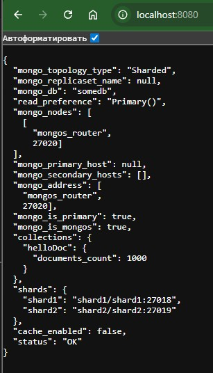

# mongo-sharding

## Как запустить

Запускаем mongodb с шардированием
```shell
docker compose up -d
```

Настраиваем конфигурацию для шардирования и заполняем mongodb данными

```shell
./scripts/mongo-init.sh
```

Если скрипт .sh не запускается - установите dos2unix и подготовьте файл к запуску

```shell
chmod +x ./scripts/mongo-init.sh
sudo apt install dos2unix
dos2unix ./scripts/mongo-init.sh
./scripts/mongo-init.sh
```

## Как проверить

### Если вы запускаете проект на локальной машине

Откройте в браузере http://localhost:8080

### Если на другой машине - сначала прокиньте этот порт через ssh

```shell
ssh -L 8080:localhost:8080 user@remote_host
```

При открытии http://localhost:8080 Вы должны увидеть:



```json
{
  "mongo_topology_type": "Sharded",
  "mongo_replicaset_name": null,
  "mongo_db": "somedb",
  "read_preference": "Primary()",
  "mongo_nodes": [
    [
      "mongos_router",
      27020]
  ],
  "mongo_primary_host": null,
  "mongo_secondary_hosts": [],
  "mongo_address": [
    "mongos_router",
    27020],
  "mongo_is_primary": true,
  "mongo_is_mongos": true,
  "collections": {
    "helloDoc": {
      "documents_count": 1000
    }
  },
  "shards": {
    "shard1": "shard1/shard1:27018",
    "shard2": "shard2/shard2:27019"
  },
  "cache_enabled": false,
  "status": "OK"
}
```

## Доступные эндпоинты

Список доступных эндпоинтов отобразится через swagger http://localhost:8080/docs

## Остановите докер и удалите контейнеры

```shell
docker compose down
```