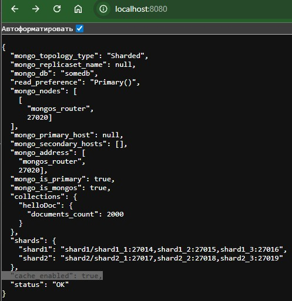

# mongo-sharding

## Как запустить

Запускаем mongodb с шардированием и приложение

```shell
docker compose up -d
```

Настраиваем конфигурацию для репликации и шардирования и заполняем mongodb данными

```shell
./scripts/mongo-init.sh
```

Если скрипт .sh не запускается - установите dos2unix и подготовьте файл к запуску

```shell
chmod +x ./scripts/mongo-init.sh
sudo apt install dos2unix
dos2unix ./scripts/mongo-init.sh
./scripts/mongo-init.sh
```

## Как проверить

### Если вы запускаете проект на локальной машине

Откройте в браузере http://localhost:8080

### Если на другой машине - сначала прокиньте этот порт через ssh

```shell
ssh -L 8080:localhost:8080 user@remote_host
```

При открытии http://localhost:8080 Вы должны увидеть:



Ожидаемый результат в поле "cache_enabled": true.

Проверка быстродействия с кэшом (повторить несколько раз):
  ```bash
  curl -s -o /dev/null -w "Status: %{http_code}\\nTotal time: %{time_total}s\\n" http://127.0.0.1:8080/helloDoc/users
  ```

Ожидаемый результат:
```shell
paul@valhalla:~/YANDEX/MONGOSHARD/task_4_mongo-sharding-repl-cache$ curl -s -o /dev/null -w "Status: %{http_code}\\nTotal time: %{time_total}s\\n" http://127.0.0.1:8080/helloDoc/users
Status: 200
Total time: 1.075591s
paul@valhalla:~/YANDEX/MONGOSHARD/task_4_mongo-sharding-repl-cache$ curl -s -o /dev/null -w "Status: %{http_code}\\nTotal time: %{time_total}s\\n" http://127.0.0.1:8080/helloDoc/users
Status: 200
Total time: 0.005677s
```

## Остановите докер и удалите контейнеры

```shell
docker compose down
```